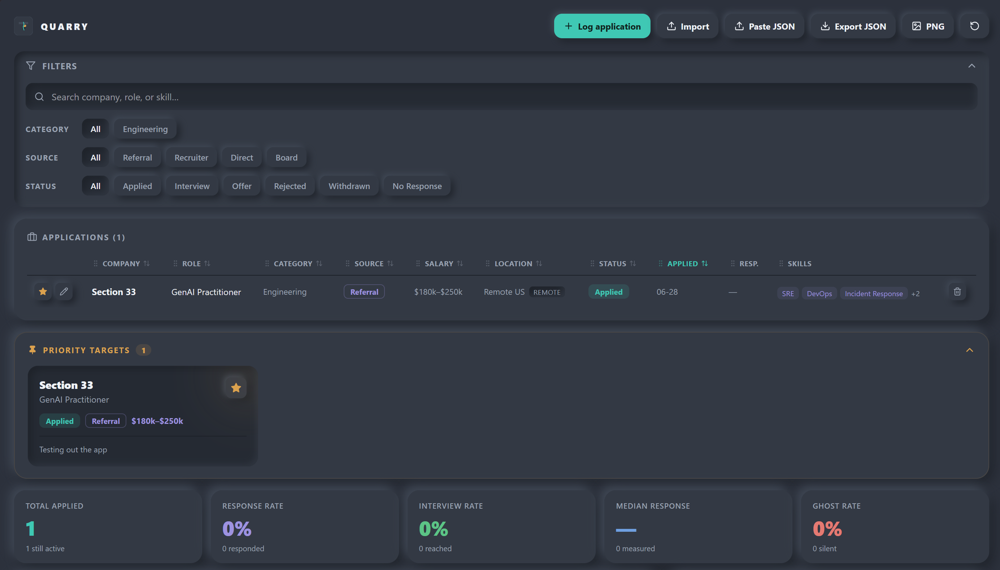
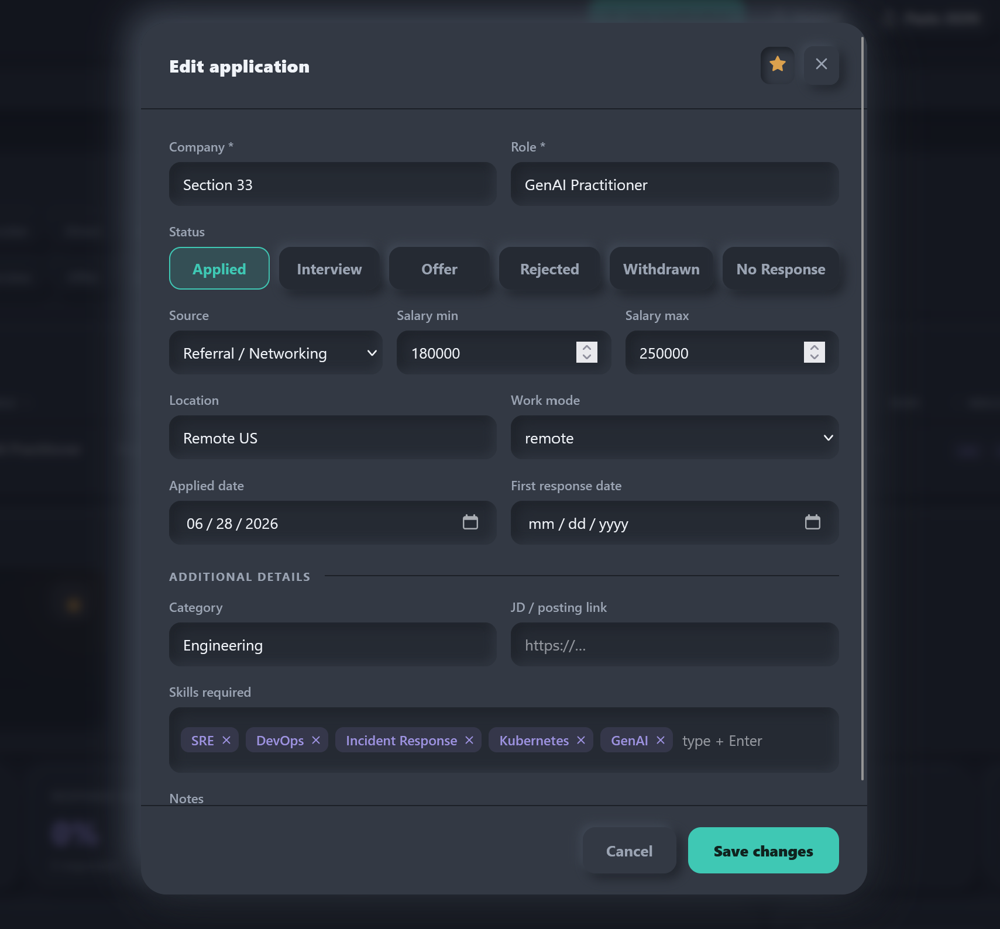
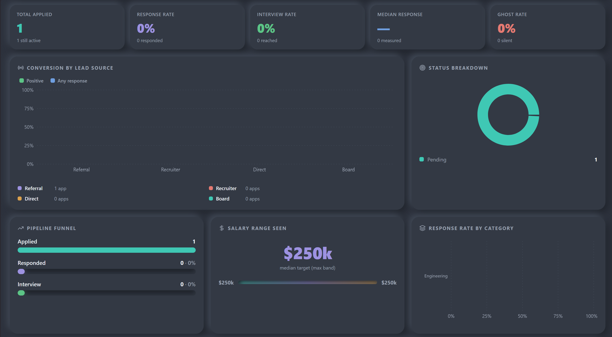
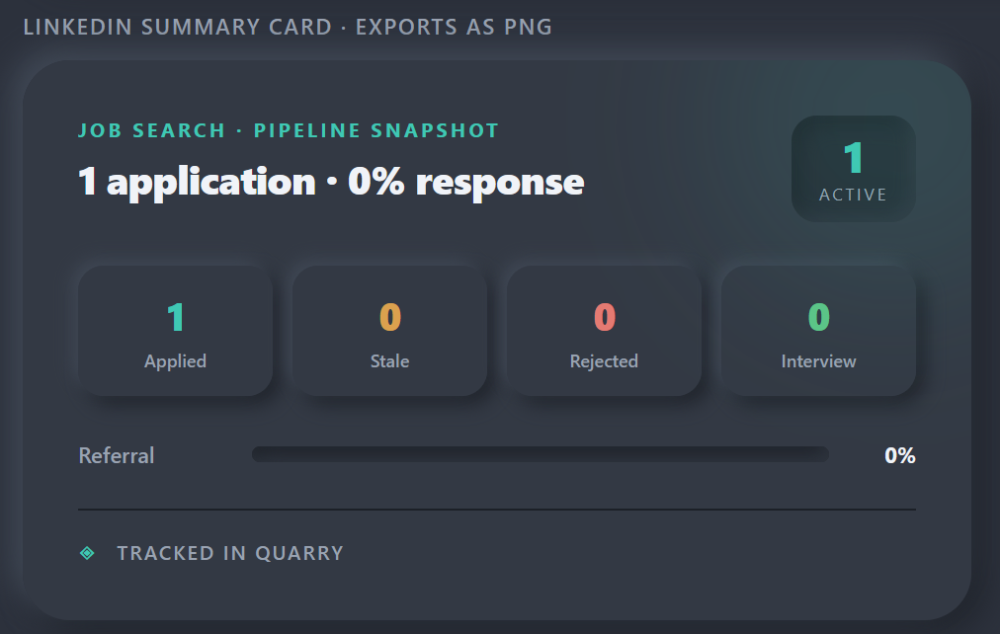
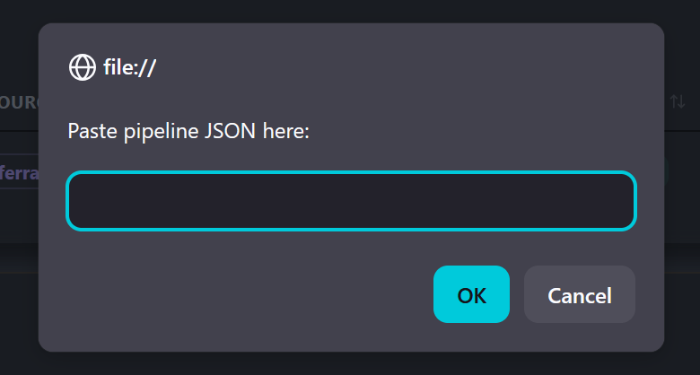

# Quarry

A job-search tracker that treats the hunt like a sales pipeline. Applications are leads,
sources and categories are segments, statuses are pipeline stages, and the dashboard shows
where your effort actually converts.

Yes, this could have been a spreadsheet and some pivot tables.

**Live:** 
- https://quarry.section33.io
- https://nicholas-a-hall.github.io/quarry/

---

## Your data never leaves your device

Quarry has no backend and no accounts. Everything you enter is stored only in your own
browser (localStorage) and never touches a server. This page is public, but it ships
empty, so anyone who opens it sees a blank tool, not your data.

To move your pipeline between devices or back it up, use **Export JSON** and **Import JSON**.
That file is yours; keep it wherever you like.

---

## What it does

**Track every application** with company, role, category, source, salary range, location,
status, required skills, a link to the posting, and dates. Required fields are just company
and role; everything else is optional.

**See where you actually convert.** Every chart is derived live from your records:

- **Conversion by lead source** — referrals almost always convert at a multiple of cold
  applications. Seeing your own number tells you where to spend effort.
- **Pipeline funnel** — applied to responded to interview, with stage conversion.
- **Response rate by category** — which kinds of roles are landing.
- **Status breakdown, salary ranges, in-demand skills, weekly trend.**

**Stay on top of what's going cold.** Applications still in "applied" after two weeks are
automatically flagged stale.

**Pin priority targets.** Star the roles you most want; they surface in their own section.

**Share a snapshot.** Export a summary card as a PNG for LinkedIn or anywhere else.

---

## How the pipeline model works

| Concept        | In a job search                                              |
|----------------|-------------------------------------------------------------|
| Lead           | An application                                               |
| Category       | Category (role type) and source (referral / recruiter / direct / board) |
| Pipeline stage | Status: applied, interview, offer, rejected, withdrawn, no response |
| Conversion     | Response rate, interview rate, sliced by segment            |

Statuses map to sentiment: interview and offer are positive, rejected is negative, and
*withdrawn* (you pulled out) counts as a response without being a negative mark against you.

---

## This file

`index.html` is a single, fully self-contained build. Every library is bundled in, so it
works with no internet connection once loaded and depends on no external services.

The development source and build script live alongside it (`PipelineDashboard.jsx`,
`index-cdn.html`, `build-offline.js`). See `QUARRY-HANDOFF.md` if you're continuing
development.

---

## Screenshots

